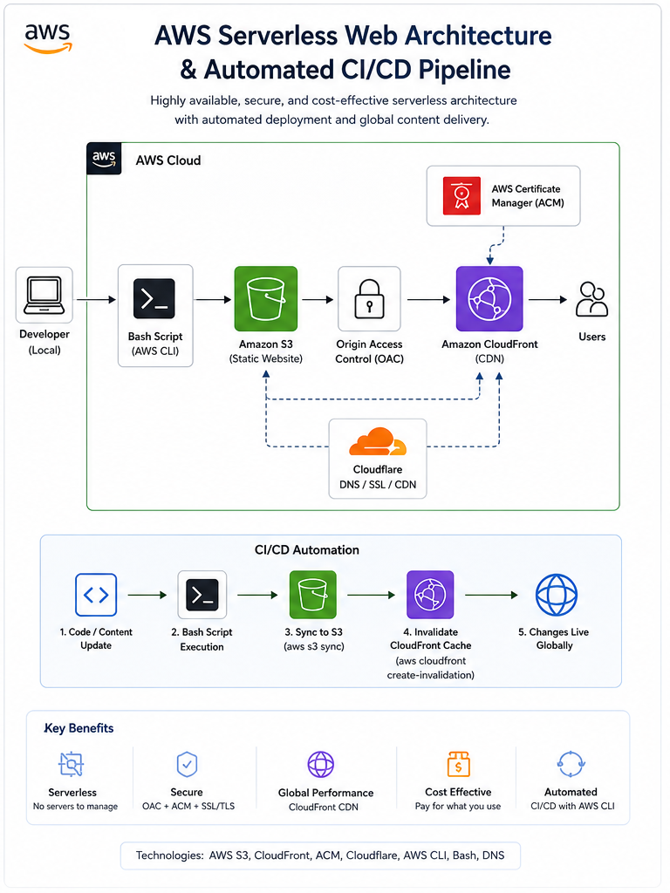

# AWS Serverless Web Architecture & Automated CI/CD Pipeline

A production-ready, secure, and fully automated multi-cloud frontend infrastructure layout mapping a custom domain to a globally distributed edge network.

## 🏗️ Architecture Design
- **Frontend Hosting:** Amazon S3 (Configured as a private object storage vault with public access completely blocked).
- **Global Content Delivery:** Amazon CloudFront CDN (Serving files worldwide with ultra-low latency).
- **DNS & Edge Layer Security:** Cloudflare DNS configured with Full (strict) SSL/TLS encryption to eliminate edge redirect loops and mitigate Denial-of-Wallet (DoW) billing vulnerabilities.
- **Access Control:** AWS Origin Access Control (OAC) to enforce the Principle of Least Privilege, completely isolating the underlying S3 bucket from raw public traffic.

## 🚀 DevOps Automation (CI/CD)
The included `deploy.sh` script automates the entire deployment lifecycle from a local terminal or AWS CloudShell terminal with a single command:
1. Safely synchronizes changed multi-media assets and structural updates directly to Amazon S3 using the AWS CLI.
2. Programmatically triggers a global cache invalidation (`/*`) across all CloudFront edge locations to ensure changes propagate live worldwide instantly.

